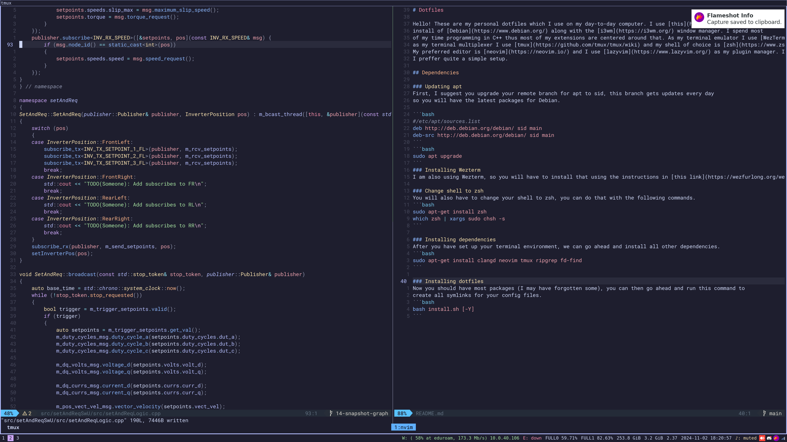

# Dotfiles

Hello! These are my personal dotfiles which I use on my day-to-day computer. I use [this](https://cdimage.debian.org/cdimage/daily-builds/daily/arch-latest/amd64/iso-cd/)
install of [Debian](https://www.debian.org/) along with the [i3wm](https://i3wm.org/) window manager. I spend most
of my time programming in C++ thus most of my extensions are centered around that. As my terminal emulator I use [WezTerm](https://wezfurlong.org/wezterm/) and 
as my terminal multiplexer I use [tmux](https://github.com/tmux/tmux/wiki) and my shell of choice is [zsh](https://www.zsh.org/) with [Oh My ZSH!](https://ohmyz.sh/). 
My preferred editor is [neovim](https://neovim.io/) and I use [lazyvim](https://www.lazyvim.org/) as my plugin manager. In general
I preffer quite a simple setup.



## Dependencies

### Updating apt
First, I suggest you upgrade your remote branch for apt to sid, this branch gets updates every day 
so you will have the latest packages for Debian.

```bash
#/etc/apt/sources.list
deb http://deb.debian.org/debian/ sid main
deb-src http://deb.debian.org/debian/ sid main
```
```bash
sudo apt upgrade
```
### Installing Wezterm
I am also using Wezterm, so you will have to install that using the instructions in [this link](https://wezfurlong.org/wezterm/install/linux.html#__tabbed_1_3).

### Change shell to zsh
You will also have to change your shell to zsh, you can do that with the following commands.
```bash
sudo apt-get install zsh
which zsh | xargs sudo chsh -s
```

### Installing dependencies
After you have set up your terminal environment, we can go ahead and install all other dependencies.
```bash
sudo apt-get install clangd neovim tmux ripgrep fd-find 
```

### Installing dotfiles
Now you should have most packages (I may have forgotten some), you can then go ahead and run this command to
create all symlinks for your config files.
```bash
bash install.sh [-Y]
```
